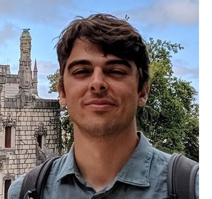

 

I started my PhD in AI at the Sapienza University of Rome, CS department in late 2019. I work in the [GLADIA](https://gladia.di.uniroma1.it/) research group advised by [Emanuele Rodolà](https://scholar.google.com/citations?user=-EH4wBYAAAAJ&hl=en).

Before joining the group, my studies have embraced two big fields, physics and computer science, and have been contaminated by many others, thanks to the [SSAS](https://www.uniroma1.it/en/pagina/school-advanced-studies) interdisciplinary honor program.

---

**What makes us humans?**
My personal search for an answer today is focused on the fundamental nature of knowledge and what makes learning possible. 

My current research interests include two great challenges of deep learning, namely the data/computation bottlenecks and the generalization gaps. Today my best bet to solve these challenges involves including natural language in the neural pipeline.

---

This website is powered by [fastpages](https://github.com/fastai/fastpages) [^1].

[^1]:a blogging platform that natively supports Jupyter notebooks in addition to other formats.
